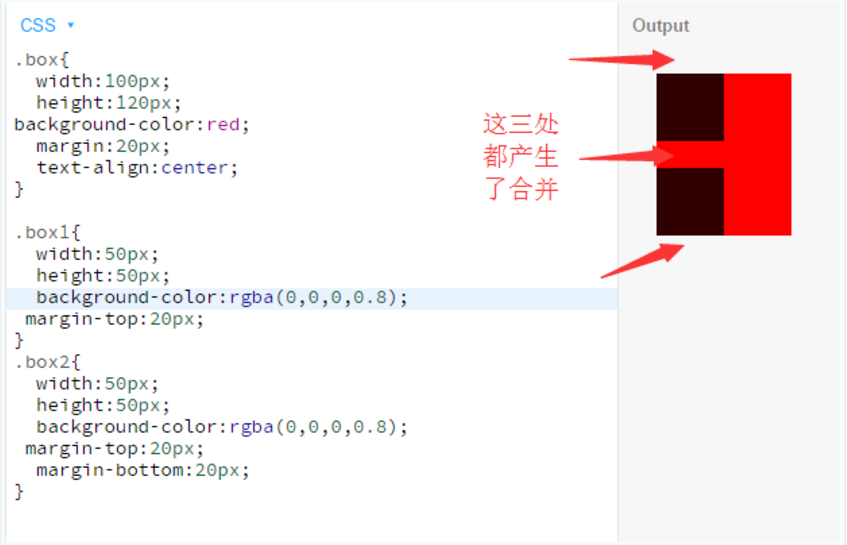

1. 浮动元素有什么特征？对父容器、其他浮动元素、普通元素、文字分别有什么影响?

>浮动元素不在文档的普通流中，它可以根据float属性值而左右移动，直到它的外边缘碰到包含框或者另一个浮动元素的框的边缘才停止移动。

>对父容器的影响：如果父容器的子元素都是浮动元素，那么父容器会失去高度，在浮动元素之外。视觉上，父容器没有包含住浮动的子元素。

>其它浮动元素的影响：如果包含块太窄无法容纳水平排列的全部浮动元素，那么其它浮动元素会向下移动，直到有足够的空间，而如果浮动元素的高度不同，那么向下移动的时候可能会被卡住。

>普通元素的影响：普通元素会视浮动元素不见，占据浮动元素原有的位置，但会被浮动元素遮罩。

>对文字的影响：文字会感知到浮动元素的存在，会留出空间，形成环绕效果。


2. 清除浮动指什么? 如何清除浮动? 两种以上方法


>清除浮动是指结合clear属性让父元素在视觉上包围浮动元素。清除浮动的方法：
 
 （1）	在父元素的子元素最后添加一个空div，并对其设置样式：clear:both;
 由于在子元素最后添加了空div，并清除了浮动，因此父容器被撑开，实现了在视觉上包围浮动元素的效果。
 
 （2）	利用BFC来清除浮动。
 因为BFC可以包含浮动，因此可以让父元素生成一个新的BFC从而包围浮动的子元素。
 可以对父元素设定以下样式之一生成新BFC。
 float: left | right;
 overflow: hidden | auto | scroll;
 display: table-cell | table-caption | inline-block;
 position: absolute | fixed;
 
 （3） 结合CSS特性的通用清除浮动方案，其本质还是第1种方法。
 ```
  .clearfix{
    *zoom: 1;
  }
  .clearfix:after{
    content: ””; 
    display: block; 
    clear: both;
  }
 ```
3. 有几种定位方式，分别是如何实现定位的，参考点是什么，使用场景是什么？


>有6种定位方式：

 inherit：从父元素继承；
 
 static：默认值，没有定位，元素出现在正常的文档流中。参考点是文档流中的位置。
 
 relative：相对定位。相对于元素本身正常位置进行定位，通过top、bottom、left、right属性来设置偏移量。使用场景：为绝对定位设定参照物或对元素自身位置进行局部调整。
 
 absolute：绝对定位。相对于static定位意外的第一个祖先元素进行定位，若都没有发现则以html标签为参考进行定位。使用场景：当想让元素参照特定参照物进行定位时使用。
 
 fixed：固定定位。生成绝对定位元素，相对于viewport进行定位。
 
 sticky：对象在常态时遵循普通流。它就像是relative和fixed的合体，当在屏幕中时按常规流排版，当卷动到屏幕外时则表现如fixed。

4. z-index 有什么作用? 如何使用?

> 因为绝对定位的元素脱离了普通流，所以绝对定位的元素可以覆盖页面上的其它元素。这时可以通过给元素设置z-index属性来控制叠放顺序，该属性值越高，元素位置越靠上。


5. position:relative和负margin都可以使元素位置发生偏移?二者有什么区别

>position:relative;只相对自己原本位置发生偏移，不影响其它普通流中元素的位置。
>margin：除了让元素自身发生偏移还影响其它普通流中的元素。


6. BFC 是什么？如何生成 BFC？BFC 有什么作用？举例说明

>BFC是块级格式上下文。其定义是：浮动、绝对定位（绝对定位、固定定位）元素、块级容器（如inline-block、 table-cell、table-caption）并不是块级盒子，还包括哪些overflow属性值取值visible以外的块级盒子，会为它们的内容物创建一个新的块级格式化上下文。对元素设置以下属性就可以生成BFC：

float: left | right;

overflow: hidden | auto | scroll;

display: table-cell | table-caption | inline-block;

position: absolute | fixed;

>BFC的作用有：

（1）	解决margin重叠问题。所谓margin重叠是指处于同一个BFC的相邻元素、嵌套元素，只要它们之间没有阻挡（如：边框、非空内容、padding等）就会发生margin重叠。这是只要让其中一个元素生成新的BFC就能解决margin重叠问题。

（2）	清除浮动。因为BFC可以包含浮动，所以让父容器生成新的BFC可以让父容器在视觉上包围了浮动的子元素，因而清除了浮动。

7. 在什么场景下会出现外边距合并？如何合并？如何不让相邻元素外边距合并？给个父子外边距合并的范例

>外边距合并指的是，当两个垂直外边距相遇时，即当一个元素出现在另一个元素上面时，第一个元素的下外边距与第二个元素的上外边距会发生合并。它们将形成一个外边距。合并后的外边距的高度等于两个发生合并的外边距的高度中的较大者。父子外边距合并的条件是父元素没有边框和padding隔开。形成BFC 可以阻止外边柜合并，如上一题的给元素添加浮动，绝对定位，inline-block,父子元素情况下，给父元素添加overflow不为none也可以阻止。

