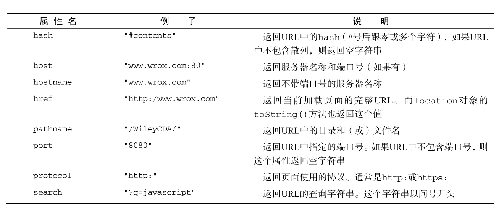

## 高程第8章 第9章读书笔记  BOM

本章内容
* 理解window对象——BOM核心
* 控制窗口、框架和弹出窗口
* 利用location对象中的页面信息
* 利用navigator对象了解浏览器

1. window对象

> BOM的核心对象：window，他表示浏览器的一个实例。同时也是ECMAScript在浏览器中的Global对象。

1.1 全局作用域

  由于window对象同时扮演着ECMAScriot中Global对象角色，因此所有在全局作用域中声明的变量、函数都会变成window对象的属性和方法。

  定义全局变量与在window对象上直接定义属性有多一点差别：全局便令不能通过delete操作符删除，而直接在window对象上定义的属性可以。

1.2 窗口关系及框架

  如果页面中包含框架，则每个框架都拥有自己的window对象，并且保存在frames集合中。
  
  > 此处第一次接触，待理解补充
  
1.3 窗口位置
  
  > ie Safari Opera Chrome提供的属性
  
  screenLeft: 窗口相对于屏幕左边的位置
  screenTop： 窗口相对于屏幕上边的位置
  
  > Firefox 提供（Safari chrome 支持）
  
  screenX：窗口相对于屏幕左边的位置
  screenY：窗口相对于屏幕上边的位置
  
  -------
  
  跨浏览器获取窗口位置
  ```
  var leftPos = (typeof window.screenLeft == "number") ? window.screenLeft : window.screenX;
  var topPos = (typeof window.screenTop == "number") ? window.screenTop : window.screenY;
  ```
  
1.4 窗口大小 

  * innerWidth: 页面视图区的宽度
  * innerHeight: 页面视图区的高度
  * outerWidth ：个浏览器返回值不同
  * outerHeight ：个浏览器返回值不同 

> 在 IE、Firefox、Safari、Opera 和 Chrome 中， document.documentElement.clientWidth 和
  document.documentElement.clientHeight 中保存了页面视口的信息。在 IE6 中，这些属性必须在
  标准模式下才有效；如果是混杂模式，就必须通过 document.body.clientWidth 和 document.body.
  clientHeight 取得相同信息。而对于混杂模式下的 Chrome，则无论通过 document.documentEle-
  ment 还是 document.body 中的 clientWidth 和 clientHeight 属性，都可以取得视口的大小。


获取页面视口的大小

```
    var pageWidth = window.innerWidth,
    pageHeight = window.innerHeight;
    if (typeof pageWidth != "number"){
      if (document.compatMode == "CSS1Compat"){
          pageWidth = document.documentElement.clientWidth;
          pageHeight = document.documentElement.clientHeight;
      } else {
          pageWidth = document.body.clientWidth;
          pageHeight = document.body.clientHeight;
      }
    }
```


1.5  导航和打开窗口

  使用 window.open() 方法既可以导航到一个特定的 URL，也可以打开一个新的浏览器窗口。这个方法可以接收 4 个参数：要加载的 URL、窗口目标、一个特性字符串以及一个表示新页面是否取代浏览器历史记录中当前加载页面的布尔值
  
  window.close()关闭浏览器窗口。
  
1.6   间歇调用和超时调用
 JavaScript 是单线程语言，但它允许通过设置超时值和间歇时间值来调度代码在特定的时刻执行。前者是在指定的时间过后执行代码，而后者则是每隔指定的时间就执行一次代码。
 
     setTimeout（）：它接受两个参数：要执行的代码和以毫秒表示的时间（即在执行代码前需要等待多少毫秒），该方法会返回一个数值 ID
     clearTimeout（）：接收超时调用ID 
     setInterval()：它接受两个参数：要执行的代码和以毫秒表示的时间（即在执行代码前需要等待多少毫秒），该方法会返回一个数值 ID
     clearInterval()：接收间歇调用ID

> 超时调用的代码都是在全局作用域中执行的，因此函数中 this 的值在非严格模
  式下指向 window 对象，在严格模式下是 undefined 。
  
  此外，如果接收是三个以上的参数，那么从第三个参数开始作为函数的参数使用
  
  1.7 系统对话框
  
  alert() 方法的结果就是向用户显示一个系统对话框
  confirm() 方法可以检查 confirm() 方法返回的布尔值，点确定为true，取消为false
  prompt() 方法用于提示用户输入一些文本。提示框中除了显示 OK 和 Cancel 按钮之外，还会显示一个文本输入域，以供用户在其中输入内容。prompt() 方法接受两个参数：要显示给用户的文本提示和文本输入域的默认值（可以是一个空字符串）。


2 . location 对象
它既是 window 对象的属性，也是document 对象的属性；换句话说.window.location 和 document.location 引用的是同一个对象。



2.2 位置操作  

* location.assign("http://www.wrox.com");
这样，就可以立即打开新 URL 并在浏览器的历史记录中生成一条记录

```
    //假设初始 URL 为 http://www.wrox.com/WileyCDA/
    //将 URL 修改为"http://www.wrox.com/WileyCDA/#section1"
    location.hash = "#section1";
    //将 URL 修改为"http://www.wrox.com/WileyCDA/?q=javascript"
    location.search = "?q=javascript";
    //将 URL 修改为"http://www.yahoo.com/WileyCDA/"
    location.hostname = "www.yahoo.com";
    //将 URL 修改为"http://www.yahoo.com/mydir/"
    location.pathname = "mydir";
    //将 URL 修改为"http://www.yahoo.com:8080/WileyCDA/"
    location.port = 8080;

```


3. navigator对象 
  
  属性很多，请查阅书中内容。

4. screen对象 
JavaScript 中有几个对象在编程中用处不大，而 screen 对象就是其中之一

5. history 对象

  
  history 对象保存着用户上网的历史记录，从窗口打开的那一刻算起。因为 history 是 window
  对象的属性


### 第9章 

1.  能力检测（特性检测）

> 能力检测的目标不是识别特定的浏览器，而是识别浏览器的能力。采用这种方式不必顾及特定的浏览器如何如何，只要确定浏览器支持特定的能力，就可以给出解决方案。
