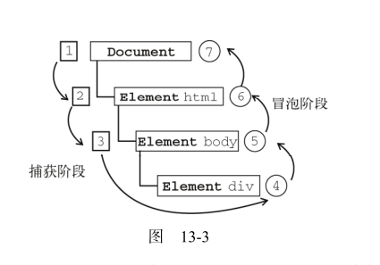

#  高级程序设计第13章

本章内容： 理解事件流，使用时间处理程序，不同时间类型

1. 事件流 

  > 事件流描述的是从页面中接收事件的顺序。
  
  * IE的事件流是事件冒泡流
  定义：即事件开始由最具体的元素接收，然后逐级向上传播到较为不具体的节点
  
  ```
    <!DOCTYPE html>
    <html>
      <head>
        <title>Event Bubbling Example</title>
      </head>
      <body>
        <div id="myDiv">Click Me</div>
      </body>
    </html>
  
  ```
  
   点击div，事件传播顺序为
   div--body ----html ---document
   
      
  
  * Netscape Communicator的事件流是事件捕获流.
  事件捕获的思想是不太具体的节点应该更早的接收到事件，而最具体的节点应该最后收到事件。
  用前面的例子，点击div事件的传播顺序为
  
  document---html---body----div
  
  
  
  * DOM事件流
  
  "DOM2级事件" 规定的事件流包括三个阶段：事件捕获、处于目标阶段和冒泡阶段
  如下图 
    
    
    
    
    -------------------
    
    
2. 事件处理程序 
  定义：事件就是用户或浏览器自身执行的某种动作，而相应某个事件的函数就叫做事件处理程序（事件侦听器）。
    
  2.1  HTML事件处理程序
   
  > 某个元素支持的每种事件，都可以用一个与相应事件处理程序同名的HTML特性指定
    
 ` <input type="button" value="Click me" onclick="alert('Clicked')" `
 调用其他地方定义的脚本
 ```
 <script type="text/javascript">
     function showMessage(){
         alert("Hello world!");
     }
 </script>
 <input type="button" value="Click Me" onclick="showMessage()" />
 ```
 
  2.2 DOM0级事件处理程序
  
  通过文档对象取得了一个按钮的引用，然后为它指定了onclick事件处理程序
  ```
    var btn = document.getElementById("myBtn");
    btn.onclick = function(){
        alert("Clicked");
    };
  ```
  删除DOM0级事件处理程序 ,将事件处理程设置为null，再单击按钮不会有任何动作发生
  `btn.onclick = null;`
 
  2.3 DOM2级事件处理程序
   'DOM2级事件'定义了两个方法，用于处理指定和删除事件处理程序的操作：addEventListener()和removeEventListener().
   素有DOM节点中都包含这两个方法。他们接受3个参数：要处理的事件名，作为事件处理程序的函数和一个布尔值。最后这个布尔值参数如果是true，表示在捕获阶段调用事件处理程序，如果是false，表示在冒泡阶段调用事件处理程序。
   
   ```
   var btn = document.getElementById("myBtn");
   btn.addEventListener("click", function(){
     alert(this.id);
   }, false);
   ```
   
   此外使用DOM2级方法添加事件处理程序的主要好处是可以添加多个事件处理程序，来看下面的例子
   ```
   var btn = document.getElementById("myBtn");
   btn.addEventListener("click", function(){
      alert(this.id);
   }, false);
   btn.addEventListener("click", function(){
       alert("Hello world!");
   }, false);
   ```
   
   这两个事件程序会按照他们的顺序触发，先显示元素的ID，再弹出"Hello World".
   
   
   注意：通过 addEventListener() 添加的事件处理程序只能使用 removeEventListener() 来移除。移除时传入的参数与添加处理程序时使用的参数相同。这也意味着通过 addEventListener()添加的匿名函数将无法移除，
   
     ```
     var btn = document.getElementById("myBtn");
     var handler = function(){
        alert(this.id);
     };
     btn.addEventListener("click", handler, false);
     // 这里省略了其他代码
     btn.removeEventListener("click", handler, false);//有效！
     ``` 
     
     
   2.4 IE事件处理程序  
     
   IE 实现了与 DOM 中类似的两个方法： attachEvent()和detachEvent() 。这两个方法接受相同的两个参数：事件处理程序名称与事件处理程序函数。由于 IE8 及更早版本只支持事件冒泡，所以通过attachEvent() 添加的事件处理程序都会被添加到冒泡阶段。
   
   ```
    var btn = document.getElementById('muBtn');
    btn.attachEvent('onclick',function(){
      alert('Clicked');
    });
    
   ```
   注意：其中的参数是onclick不是click。

在 IE 中使用 attachEvent() 与使用 DOM0 级方法的主要区别在于事件处理程序的作用域。在使用 DOM0 级方法的情况下，事件处理程序会在其所属元素的作用域内运行；在使用 attachEvent()方法的情况下，事件处理程序会在全局作用域中运行，因此this等于 window 。

```
    var btn = document.getElementById("myBtn");
    btn.attachEvent("onclick", function(){
          alert(this === window); //true
    });

```

删除事件处理程序

```
    var btn = document.getElementById("myBtn");
    var handler = function(){
       alert("Clicked");
    };
    btn.attachEvent("onclick", handler);
    // 这里省略了其他代码
    btn.detachEvent("onclick", handler)
```


2.5 跨浏览器的事件处理程序

第一个要创建的方法是 addHandler（），他的职责是视情况分别使用DOM0级，2级方法或者IE事件处理程序。这个方法属于一个名叫EventUtil的对象。接收三个参数，要操作的元素，事件名称和事件处理程序函数。
第二个是removeHandler（），接收相同的参数，职责是移除之前添加的事件处理程序

> 未完-----待补充


3. 事件对象

> 在触发DOM上的某个事件时，会产生一个事件对象，event，这个对象中包含着所有与事件有关的信息。

3.1 DOM中的事件对象

  兼容DOM的浏览器会将一个Event对象传入到事件处理程序中。
  
  ```
      var btn = document.getElementById("myBtn");
      btn.onclick = function(event){
            alert(event.type); //"click"
      };
      btn.addEventListener("click", function(event){
            alert(event.type); //"click"
      }, false);
  ```
  所有事件都会有鞋标列出的成员
  
  |属性/方法|类型和读/写|说明|
  |---|---|---|
  |bubbles|Boolean/只读|表明事件是否冒泡|
  |cancelable|Boolean/只读|表明是否可以取消事件的默认行为|
  |currentTarget|Element/只读|起事件处理程序正在处理事件的那个元素|
  |defaultPrevented|Boolean/只读|为true表示已经调用了preventDefault（）（DOM3新增）|
  |detail|Integer|与事件相关的信息|
  |eventPhase|Integer|调用事件处理程序的阶段：1 捕获，2 处于目标 3冒泡|
  |preventDefault（）|function/z只读|取消事件的默认行为，如果cancelable是true，可以使用|
  |stopImmediatePropagation（）|function|取消事件进一步捕获或冒泡，同时阻止任何事件处理程序被调用（DOM3）|
  |stopPropagation（）|function|取消事件的进一步捕获或冒泡，如果cancelable是true，可以使用|
  |target|element|事件的目标|
  |type|String|被触发的事件的类型|
  |trusted|Boolean|为true表示事件时浏览器产生的（DOM3）|
  |view|AbstractView|与实践关联的抽象视图|


阻止默认行为
只有 cancelable 属性设置为 true 的事件，才可以使用preventDefault() 来取消其默认行为。
```
    var link = document.getElementById("myLink");
    link.onclick = function(event){
    
          event.preventDefault();
   
    };
```
取消冒泡或捕获，停止事件在DOM层次中的传播
 stopPropagation() 方法用于立即停止事件在DOM层次中的传播，即取消进一步的事件捕获或冒泡。
 
 ```
 var btn = document.getElementById("myBtn");
 btn.onclick = function(event){
    alert("Clicked");
    event.stopPropagation();
 };
 
 //  不会弹出 “body clicked”
 document.body.onclick = function(event){
    alert("Body clicked");
 };
 
 ```
 
 
 3.2 IE中的事件对象
 
  要访问 IE 中的 event 对象有几种不同的方式，取决于指定事
  件处理程序的方法。
  
  * 在使用 DOM0 级方法添加事件处理程序时， event 对象作为 window 对象的一个属性存在。来看下面的例子。
  
  ```
      var btn = document.getElementById("myBtn");
      btn.onclick = function(){
          //获得事件对象
          var event = window.event;
          alert(event.type); //"click"
      };
  ```
  * 如果事件处理程序是使用attachEvent（）添加的，name就会有一个event对象作为参数被传入事件处理函数中。
  
  ```
  var btn = document.getElementById("myBtn");
  btn.attachEvent("onclick", function(event){
      // 参数的形式获得
      alert(event.type); //"click"
  });
  ```
  
  所有事件对象都会包含下表所列的属性和方法
  
  
  
  因为事件处理程序的作用域是根据指定它的方式来确定的，所以不能认为 this 会始终等于事件目标。故而，最好还是使用 event.srcElement 比较保险。
  
  ```
  var btn = document.getElementById("myBtn");
  btn.onclick = function(){
      // this 指向元素本身
      alert(window.event.srcElement === this);  //true
  };
  btn.attachEvent("onclick", function(event){
      //  this 指向了window
      alert(event.srcElement === this);  //false
  });
  ```

  取消默认事件
  
  ```
  
      var link = document.getElementById("myLink");
      link.onclick = function(){
          // 取消默认事件
          window.event.returnValue = false;
      };
  ```
  
  取消事件冒泡(IE不支持事件捕获)
  
  ```
  
  var btn = document.getElementById("myBtn");
  btn.onclick = function(){
        alert("Clicked");
        window.event.cancelBubble = true;
  };
  document.body.onclick = function(){
      alert("Body clicked");
  };
  ```
  
  3.3 跨浏览器的事件对象
  
  
  ```
      var EventUtil = {
          addHandler: function(element,type,handler){},
          getEvent: function(event){
              return event?event:window.event;
          },
          getTarget: function(event){
              return event.target||event.srcElement;
          },
          preventDefault: function(event){
              if(event.preventDefault){
                  event.preventDefault();
              } else {
                  event.returnValue = false;
              }
          },
          stopPropagation: function(event){
              if(event.stopPropagation){
                  event.stopPropagation();
              } else {
                  event.cancelable = true;
              }
          },
          removeHandler: function(elemtn,type,handler) {}
         }
  
  ```


4. 事件类型

web浏览器中可能发生的事件有很多类型，不同事件类型具有不同的信息，而“DOM3级事件” 规定了以下几类事件

  * UI（User Interface，用户界面）事件，当用户与页面上的元素交互式触发 
  * 焦点事件：当元素获得或失去焦点时触发
  * 鼠标事件：当用户通过鼠标在页面上执行操作时触发
  * 滚轮事件：当使用鼠标滚轮或者类似设备时触发
  * 文本事件： 当在文档中输入文本是触发
  * 键盘事件：当用户通过键盘在页面上执行操作时触发
  * 合成事件，当为IME（Input Method Editor，输入法边界器）输入文字时触发；
  * 变动事件：当底层DOM结构发生变化时触发
  * 变动名称事件，当元素或属性名变动时触发，此类事件已经被废弃，没有任何浏览器实现他们。
