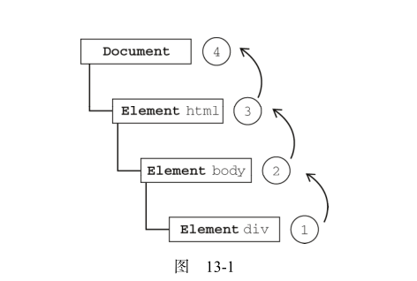
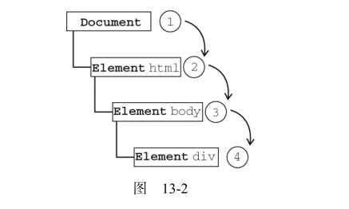

题目1： DOM0 事件和DOM2级在事件监听使用方式上有什么区别？
```
    <input type="button" id="btn" value = "click me">

    // DOM0级
    // 侦听
    btn.onclick = function(){ console.log('DOM0级') }；
    //  清除
    
    btn.onclikc = null
    // DOM 2级
    // 侦听
    btn.addEventListener('click',function(){ console.log( "DOM2级,不可消除事件")  },false)
    btn.addEventListener('click',handler,false);
    function handler(){ console.log('可消除DOM2级事件') }
    // 清除
    btn.removeEventListener('click',handler,false);
```
区别：DOM2级可以对同一元素同一事件添加多个处理程序.
      DOM0级不能对同一元素同一事件添加多个处理程序


题目2： attachEvent与addEventListener的区别？

区别：
    
    接收参数不同，attachEvent接收两个参数，addEventListener接收三个参数\;
    IE只支持事件冒泡。
    
    参数中事件type也不一样，如 onclick事件时，传给addEventListener的参数为'click',传给attachEvent的参数为 'onclick'
    
    
    函数中 this的指向不同，attachEvent中  this指向window。addEventListener中的this指向元素本身。
题目3： 解释IE事件冒泡和DOM2事件传播机制？

IE事件冒泡机制： 从最具体的元素传递到最不具体的元素
如点击body里面的div


事件捕获：从最不具体的元素传递到最具体的元素
如点击body里面的div



        
题目4：如何阻止事件冒泡？ 如何阻止默认事件？

* IE事件：取消冒泡，设置 event.cancelBubble = true
        取消默认事件： event.returnValue = false
* DOM2 事件： 取消冒泡，event.stopPropagation();
        取消默认事件： event.preventDefault();
        
        
题目5：有如下代码，要求当点击每一个元素li时控制台展示该元素的文本内容。不考虑兼容
```
      <ul class="ct">
          <li>这里是</li>
          <li>饥人谷</li>
          <li>前端6班</li>
      </ul>
      <script>
      //todo ...
      var ul = document.getElementsByClassName('ct')[0];
      ul.addEventListener('click',function(event){
        console.log(event.target.innerText);
      },false)
      </script>
```

题目6： 补全代码，要求：

当点击按钮开头添加时在<li>这里是</li>元素前添加一个新元素，内容为用户输入的非空字符串；当点击结尾添加时在最后一个 li 元素后添加用户输入的非空字符串.
当点击每一个元素li时控制台展示该元素的文本内容。

```
  <ul class="ct">
      <li>Hello World</li>
      <li>Hello HTML</li>
      <li>Hello Javascript</li>
  </ul>
  <input class="ipt-add-content" placeholder="添加内容"/>
  <button id="btn-add-start">开头添加</button>
  <button id="btn-add-end">结尾添加</button>
  <script>
      function $(cla){
          return document.querySelector(cla)
      }
      function $$(cla){
          return document.querySelectorAll(cla)
      }
  
      // 添加到头部
      $('#btn-add-start').addEventListener('click',function(){
          var content = $('.ipt-add-content').value;
          if(content === ''){
              alert('您未输入任何内容');
              return;
          }
          var newLi = document.createElement('li');
          newLi.innerText = content;
          $('.ct').insertBefore(newLi,$('.ct').children[0]);
  
      },false)
      // 添加到尾部
  
   $('#btn-add-end').addEventListener('click',function(){
          var content = $('.ipt-add-content').value;
          if(content === ''){
              alert('您未输入任何内容');
              return;
          }
          var newLi = document.createElement('li');
          newLi.innerText = content;
          $('.ct').appendChild(newLi);
  
      },false)
  
      // 点击输出内容
  
      $('.ct').addEventListener('click', function(event) {
          console.log(event.target.innerText);
      }, false)
  </script>
```

题目7： 补全代码，要求：当鼠标放置在li元素上，会在img-preview里展示当前li元素的data-img对应的图片。
```
    <ul class="ct">
        <li data-img="1.png">鼠标放置查看图片1</li>
        <li data-img="2.png">鼠标放置查看图片2</li>
        <li data-img="3.png">鼠标放置查看图片3</li>
    </ul>
    <div class="img-preview"></div>
    <script>
    //你的代码
    function $(cla) {
        return document.querySelector(cla)
        console.log(2);
      }
    
      function $$(cla) {
        return document.querySelectorAll(cla)
      }
      //初始化照片
      addImg('1.png');
    
      $('.ct').addEventListener('mouseover', showImg,false);
    
    
      function showImg(event) {
        var event = event || window.event;
        var target = event.target || event.srcElement;
        var url = target.getAttribute('data-img');
        addImg(url);
      }
    
      function addImg(url) {
    
        var img = document.createElement('img');
        img.src = 'img/'+url;
        $('.img-preview').innerHTML = '';
        $('.img-preview').appendChild(img);
      }

    </script>
```
[查看效果](imgshow.html);

题目8： 在 github 上创建个人项目，把视频里事件兼容的函数写法放入项目，在 Readme.md里描述项目(选做题目)(暂时未做)
