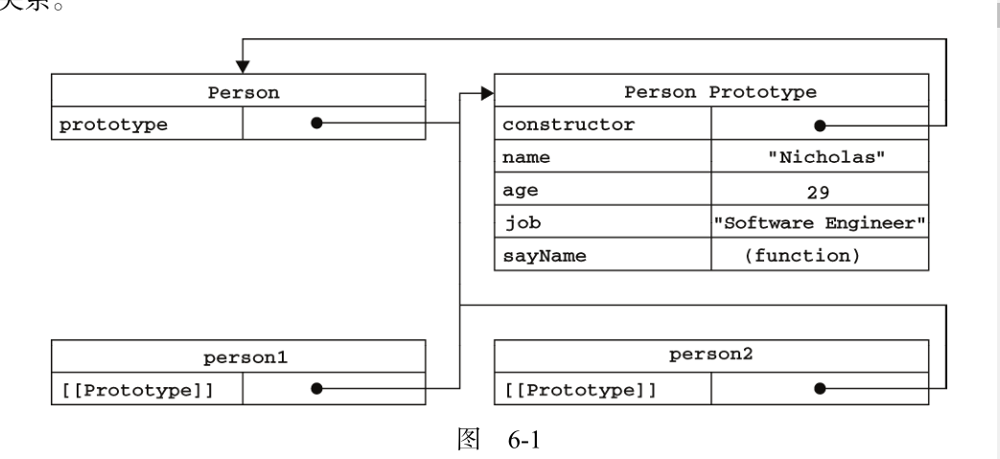

# 高级程序设计 第六章  面向对象的程序设计

本章内容

* 理解对象属性
* 理解并创建对象
* 理解继承

### 1. 理解对象

最简单的创建对象方式：创建一个Object的实例，然后再为他添加属性
```
	var person = new Object();
		person.name = "Nicholas";
		person.age = 29;
		person.job = "Software Engineer";
		person.sayName = function(){
		alert(this.name);
	};

```
对象字面量创建对象

```
	var person = {
		name: "Nicholas",
		age: 29,
		job: "Software Engineer",
		sayName: function(){
		alert(this.name);
		}
	};

```

1.1 属性类型

ECMAScript（5）中有两种属性：数据属性和访问器属性。

> 数据属性：包含一个数据值的位置。在这个位置可以读取和写入值。数据属性有4个描述其行为的热性。
	
* [[Configurable]] ：表示能否通过 delete 删除属性从而重新定义属性，能否修改属性的特性，或者能否把属性修改为访问器属性。像前面例子中那样直接在对象上定义的属性，它们的这个特性默认值为 true 。

* [[Enumerable]] ：表示能否通过 for-in 循环返回属性。像前面例子中那样直接在对象上定义的属性，它们的这个特性默认值为 true 
* [[Writable]] ：表示能否修改属性的值。像前面例子中那样直接在对象上定义的属性，它们的这个特性默认值为 true 。
* [[Value]] ：包含这个属性的数据值。读取属性值的时候，从这个位置读；写入属性值的时候，把新值保存在这个位置。这个特性的默认值为 undefined 。

要使用 Object。defineProperty()修改上列属性。例如

```
	var person = {};
	Object.defineProperty(person, "name", {
		configurable: false,
		value: "Nicholas"
	});
	alert(person.name); //"Nicholas"
	delete person.name;
	alert(person.name); //"Nicholas"
```

> 访问器属性；不包含数据值；他们包含一对儿getter和setter函数（非必须的）。在读取访问器属性时，会调用getter函数，这个函数负责返回有效的值。在写入访问器属性时，会调用setter函数，并传入新值，这个函数负责如何处理数据。同样有四个属性

* [[Configurable]] ：表示能否通过 delete 删除属性从而重新定义属性，能否修改属性的特
性，或者能否把属性修改为数据属性。对于直接在对象上定义的属性，这个特性的默认值为
true 。
* [[Enumerable]] ：表示能否通过 for-in 循环返回属性。对于直接在对象上定义的属性，这
个特性的默认值为 true 。
* [[Get]] ：在读取属性时调用的函数。默认值为 undefined 。
* [[Set]] ：在写入属性时调用的函数。默认值为 undefined 


访问器属性不能直接定义，必须使用Object。defineProperty()来定义;

```
	var book = {
		_year: 2004,
		edition: 1
	};
	Object.defineProperty(book, "year", {
		get: function(){
			return this._year;
		},
		set: function(newValue){
			if (newValue > 2004) {
				this._year = newValue;
				this.edition += newValue - 2004;
			}
		}
	});
	book.year = 2005;
	alert(book.edition);

```

1.2 定义多个属性

由于为对象定义多个属性的可能性很大，ECMAScript又定义了一个Object.defineProperties（）。利用这个方法可以通过描述符一次定义多个属性，这个方法接收两个对象参数：第一个对象是要添加和修改其属性的对象，第二个对象的属性与第一个对象中药添加或修改的属性一一对应。例如

```
var book = {};
Object.defineProperties(book, {
	_year: {
		value: 2004
	},
	edition: {
		value: 1
	},
	year: {
		get: function(){
			return this._year;
		},
		set: function(newValue){
			if (newValue > 2004) {
				this._year = newValue;
				this.edition += newValue - 2004;
			}
		}
	}
});

```

1.3  读取属性的特性 

使用 ECMAScript 5 的 Object.getOwnPropertyDescriptor() 方法，可以取得给定属性的描述符。这个方法接收两个参数：属性所在的对象和要读取其描述符的属性名称。

### 2. 创建对象

2.1 工厂模式

工厂模式是软件工程领域一种广为人知的设计模式。这种模式抽象了创建决堤对象的过程。

```
	function createPersong(name,age,job){
		var o = new Object();
		o.name = name;
		o.age = age;
		o.job = job;
		o.sayName: fucntion(){alert(this.name)}
	}
	var person1 = createPerson("Nicholas", 29, "Software Engineer");
	var person2 = createPerson("Greg", 27, "Doctor");
```
存在问题：没有解决对象识别问题（即怎么样知道一个对象的类型）

2.2 构造函数模式

构造函数可以用来创建特定类型的对象。

```
	function Person(name,age,job){
		this.name = name;
		this.age = age;
		this.job = job;
		this.sayName = function(){
			alert(this.name);
		}
	}
	var person1 = new Person("Nicholas", 29, "Software Engineer");
	var person2 = new Person("Greg", 27, "Doctor");  // constructor 指向 Person。
```
特点：

* 没有显示地创建对象
* 直接将属性和方法赋值给了this对象
* 没有return语句

要创建Person的新实例，必须使用new 操作符。new操作符的作用

	1. 创建一个对象；
	2. 将构造函数的作用域赋值给新对象（因此this就指向了这个对象）；
	3. 执行够咱函数中的代码（为这个新对象添加属性）
	4. 返回新对象

检测对象类型 使用 instanceof 操作符更可靠一些

```
	alert(person1 instanceof Object); //true
	alert(person1 instanceof Person); //true
	alert(person2 instanceof Object); //true
	alert(person2 instanceof Person); //true
```
> 将构造函数当做函数

构造函数与其他函数的唯一区别，就在于调用他们的方式不同。Person（）函数可以通过下列任意种方式来调用

```
	// 当作构造函数使用
	var person = new Person("Nicholas", 29, "Software Engineer");
	person.sayName(); //"Nicholas"
	// 作为普通函数调用
	Person("Greg", 27, "Doctor"); // 添加到 window
	window.sayName(); //"Greg"
	// 在另一个对象的作用域中调用
	var o = new Object();
	Person.call(o, "Kristen", 25, "Nurse");
	o.sayName(); //"Kristen"
```

> 构造函数的问题：就是每个方法都要在每个实例上重新创建一遍。
解决办法如下

```
	function Person(name, age, job){
		this.name = name;
		this.age = age;
		this.job = job;
		this.sayName = sayName;
	}
	function sayName(){
		alert(this.name);
	}
	var person1 = new Person("Nicholas", 29, "Software Engineer");
	var person2 = new Person("Greg", 27, "Doctor");
```
定义全局函数，但是如果方法很多，这也无法忍受


2.3 原型模式 

创建每个函数都有一个prototype属性，这个属性时一个指针，直线给一个对象，而这个兑现给的用途就是包含可以有特定类型的的所有实例**共享的属性和方法**。

```
	function Person(){
	}
	Person.prototype.name = "Nicholas";
	Person.prototype.age = 29;
	Person.prototype.job = "Software Engineer";
	Person.prototype.sayName = function(){
		alert(this.name);
	};
	var person1 = new Person();
	person1.sayName(); //"Nicholas"
	var person2 = new Person();
```
> 理解原型对象

创建一个新函数，就会根据一组特定的规则为该函数创建一个prototype属性，这个属性指向函数的原型对象。在默认情况下，所有原型对象都会自动获得一个constructor(构造函数)属性，这个属性包含一个指向prototype属性所在函数的指针。

创建了自定义的构造函数之后，其原型对象默认只会取得 constructor 属性；至于其他方法，则
都是从 Object 继承而来的。当调用构造函数创建一个新实例后，该实例的内部将包含一个指针（内部
属性），指向**构造函数的原型对象**。ECMA-262 第 5 版中管这个指针叫 [[Prototype]] 。虽然在脚本中
没有标准的方式访问 [[Prototype]] ，但 Firefox、Safari 和 Chrome 在每个对象上都支持一个属性
\__proto__ ；而在其他实现中，这个属性对脚本则是完全不可见的。不过，要明确的真正重要的一点就
是，这个连接存在于实例与构造函数的原型对象之间，而不是存在于实例与构造函数之间。
以前面使用 Person 构造函数和 Person.prototype 创建实例的代码为例



图中，Person.prototype 指向了原型对象，而Person.prototype.constructor又指回Person。Person的每个实例---person1和person2都包含一个内部属性，该属性仅仅指向了原型对象（Person.prototype）;换句话说，他们与构造函数没有直接关系。


还有两个属性  isPrototypeOf() 和 Object.getPrototypeOf()；详细内容参考书本。

注意： 每当查找一个属性时，先在实例上查找，如果没有再去实例的原型查找。

注意： 当为对象实例添加一个属性时，这个属性就会屏蔽原型对象中保存的同名属性

使用 hasOwnProperty() 方法可以检测一个属性是存在于实例中，还是存在于原型中。这个方法（不
要忘了它是从 Object 继承来的）只在给定属性存在于对象实例中时，才会返回 true;

```
	function Person(){
	}
	Person.prototype.name = "Nicholas";
	Person.prototype.age = 29;
	Person.prototype.job = "Software Engineer";
	Person.prototype.sayName = function(){
		alert(this.name);
	};
	var person1 = new Person();
	var person2 = new Person();
	alert(person1.hasOwnProperty("name")); //false
	person1.name = "Greg";
	alert(person1.name); //"Greg"——来自实例
	alert(person1.hasOwnProperty("name")); //true
	alert(person2.name); //"Nicholas"——来自原型
	alert(person2.hasOwnProperty("name")); //false
	delete person1.name;
	alert(person1.name); //"Nicholas"——来自原型
	alert(person1.hasOwnProperty("name")); //false
```

> 原型与in操作符

1.有两种方式使用 in 操作符：单独使用和在 for-in 循环中使用。在单独使用时， in 操作符会在通过对象能够访问给定属性时返回 true ，无论该属性存在于实例中还是原型中

2.在使用 for-in 循环时，返回的是所有能够通过对象访问的、可枚举的（enumerated）属性，其中既包括存在于实例中的属性，也包括存在于原型中的属性。屏蔽了原型中不可枚举属性（即将[[Enumerable]] 标记为 false 的属性）的实例属性也会在 for-in 循环中返回，因为根据规定，所有开发人员定义的属性都是可枚举的

3.要取得对象上所有可枚举的实例属性，可以使用ECMAScript5的Object.keys（）方法，这方法接收一个对象作为参数，返回一个包含所有可枚举属性的字符串数组。

> 更简单的语法

```
	function Person(){
	}
	// 此时Person.prototype.constructor不在指向Peroson，指向了Object构造函数；
	Person.prototype = {
		name : "Nicholas",
		age : 29,
		job: "Software Engineer",
		sayName : function () {
		alert(this.name);
		}
	};
```

> 原型的动态性

由于在原型中查找值的过程是一次搜索，因此我们对原型对象所做的任何修改都能够立即从实例上反应出来。即使显示创建了实例后修改原型也照样如此。

调用构造函数时会为实例添加一个指向最初原型的
[[Prototype]] 指针，而把原型修改为另外一个对象就等于切断了构造函数与最初原型之间的联系

> 原生对象原型: 可以取得所有默认方法的引用，也可以定义新方法。

> 原型对象的问题

```
	function Person(){
	}
	Person.prototype = {
		constructor: Person,
		name : "Nicholas",
		age : 29,
		job : "Software Engineer",
		friends : ["Shelby", "Court"],
		sayName : function () {
		alert(this.name);
		}
	};
	var person1 = new Person();
	var person2 = new Person();
	person1.friends.push("Van");
	alert(person1.friends); //"Shelby,Court,Van"
	alert(person2.friends); //"Shelby,Court,Van"
	alert(person1.friends === person2.friends); //true

```

2.4 组合使用构造函数模式和原型模式

创建自定义类型最常见方式，就是组合使用构造函数模式与原型模式。构造函数模式用于定义**实例属性**，而原型模式用于定义**方法和共享属性**；这种混成模式还支持向构造函数传递参数。

```
	function Person(name, age, job){
		this.name = name;
		this.age = age;
		this.job = job;
		this.friends = ["Shelby", "Court"];
	}
	Person.prototype = {
		constructor : Person,
		sayName : function(){
		alert(this.name);
		}
	}
	var person1 = new Person("Nicholas", 29, "Software Engineer");
	var person2 = new Person("Greg", 27, "Doctor");
	person1.friends.push("Van");
	alert(person1.friends); //"Shelby,Count,Van"
	alert(person2.friends); //"Shelby,Count"
	alert(person1.friends === person2.friends); //false
	alert(person1.sayName === person2.sayName); //true
```
在这个例子中 实力属性都是在构造函数中定义的，而所有实例共享的属性constructor和方法sayName（）都在原型中定义的。

2.5 动态原型模式

```
function Person(name, age, job){
	//属性
	this.name = name;
	this.age = age;
	this.job = job;
	// 方法 ,只在这里判断一次，不存在这个方法则创建这个方法
	if (typeof this.sayName != "function"){
		Person.prototype.sayName = function(){
			alert(this.name);
		};
	}
}
```

2.6 寄生构造函数模式

2.7 稳妥的构造函数模式

道格拉斯·克罗克福德（Douglas Crockford）发明了 JavaScript 中的稳妥对象（durable objects）这
个概念。所谓稳妥对象，指的是没有公共属性，而且其方法也不引用 this 的对象。稳妥对象最适合在
一些安全的环境中（这些环境中会禁止使用 this 和 new ），或者在防止数据被其他应用程序（如 Mashup
程序）改动时使用。稳妥构造函数遵循与寄生构造函数类似的模式，但有两点不同：一是新创建对象的
实例方法不引用 this ；二是不使用 new 操作符调用构造函数。按照稳妥构造函数的要求，可以将前面
的 Person 构造函数重写如下。


### 3. 继承  


#### 3.1 原型链

ECMAScript 中描述了**原型链**的概念，并将原型链作为实现继承的主要方法。其基本思想是利用原型让一个引用类型继承另一个引用类型的属性和方法。

> 简单回顾一下构造函数、原型和实例的关系：每个构造函数都有一个原型对象，原型对象都包含一个指向构造函数的指针，而实例都包含一个指向原型对象的内部指针。


> 原型链：假如我们让原型对象等于另一个类型的实例，结果会怎么样呢？显然，此时的原型对象将包含一个指向另一个原型的指针，相应地，另一个原型中也包含着一个指向另一个构造函数的指针。假如另一个原型又是另一个类型的实例，那么上述关系依然成立，如此层层递进，就构成了实例与原型的链条。这就是所谓原型链的基本概念。

```
	function SuperType(){
		this.property=true
	}
	SuperType.prototype.getSuperValue(){
		return this.property;
	}
	function SubType(){
		return this.subproperty = false;
	}
	//继承了 SuperType
	SubType.prototype = new SuperType();
	SubType.prototype.getSubValue = function(){
		return this.subproperty;
	}
	var instance = new SubType();
	console.log(instance.getSuperValue())
```

> 别忘记默认的原型

事实上，前面例子中展示的原型链还少一环。我们知道，所有引用类型默认都继承了 Object ，而
这个继承也是通过原型链实现的。大家要记住，所有函数的默认原型都是 Object 的实例，因此默认原
型都会包含一个内部指针，指向 Object.prototype 。这也正是所有自定义类型都会继承 toString() 、
valueOf() 等默认方法的根本原因

> 确定原型和实例的关系

第一种方式使用instanceof操作符，只要用这个操作符来测试实例与原型链中出现过的构造函数，结果就会返回true。如上面的例子

```
	alert(instance instanceof Object); //true
	alert(instance instanceof SuperType); //true
	alert(instance instanceof SubType); //true

```

第二种方法是使用isPropertyOf()方法。同样，只要是原型链中出现果的原型，都可以硕士该原型链派生的实例的原型。
```
	alert(Object.prototype.isPrototypeOf(instance)); //true
	alert(SuperType.prototype.isPrototypeOf(instance)); //true
	alert(SubType.prototype.isPrototypeOf(instance)); //true
```

> 谨慎地定义方法

子类型有时候需要重写超类型中的某个方法或者需要添加超类型中不存在的某个方法。但不管怎么样，给原型添加方法的代码一定要放在替换原型语句之后


> 原型链的问题
第一个 引用类型值的问题


第二个，不能向超类型的构造函数中传递参数（在不影响说有对象实例的情况下）

#### 3.2 借用构造函数

 ```
	function SuperType(name){
		this.name = name;
		this.colors = ["red", "blue", "green"];
	}
	SuperType.prototype.sayName = function(){
		alert(this.name);
	};
	function SubType(name, age){
	//继承属性
		SuperType.call(this, name);
		this.age = age;
	}
	//继承方法
	SubType.prototype = new SuperType();
	SubType.prototype.constructor = SubType;
	SubType.prototype.sayAge = function(){
		alert(this.age);
	};
	var instance1 = new SubType("Nicholas", 29);
	instance1.colors.push("black");
	alert(instance1.colors); //"red,blue,green,black"
	instance1.sayName(); //"Nicholas";
	instance1.sayAge(); //29
	var instance2 = new SubType("Greg", 27);
	alert(instance2.colors); //"red,blue,green"
	instance2.sayName(); //"Greg";
	instance2.sayAge(); //27

 ```

#### 3.4 原型式继承

```
	function object(o){
		function F(){}
		F.prototype = o;
		return new F();
	}
```

### 3.5 寄生式继承

 ```
	function createAnother(original){
		var clone = object(original); //通过调用函数创建一个新对象
		clone.sayHi = function(){ //以某种方式来增强这个对象
			alert("hi");
		};
		return clone; //返回这个对象
	}
 ```

 ### 3.6 寄生组合式继承

 ```
function inheritPrototype(subType, superType){
	var prototype = object(superType.prototype); //创建对象
	prototype.constructor = subType; //增强对象
	subType.prototype = prototype; //指定对象
}

 ```
 这个示例中的 inheritPrototype() 函数实现了寄生组合式继承的最简单形式。这个函数接收两
个参数：子类型构造函数和超类型构造函数。在函数内部，第一步是创建超类型原型的一个副本。第二
步是为创建的副本添加 constructor 属性，从而弥补因重写原型而失去的默认的 constructor 属性。
最后一步，将新创建的对象（即副本）赋值给子类型的原型.


### 4 总结

6.4 小结
ECMAScript 支持面向对象（OO）编程，但不使用类或者接口。对象可以在代码执行过程中创建和
增强，因此具有动态性而非严格定义的实体。在没有类的情况下，可以采用下列模式创建对象。
*  工厂模式，使用简单的函数创建对象，为对象添加属性和方法，然后返回对象。这个模式后来
被构造函数模式所取代。
*  构造函数模式，可以创建自定义引用类型，可以像创建内置对象实例一样使用 new 操作符。不
过，构造函数模式也有缺点，即它的每个成员都无法得到复用，包括函数。由于函数可以不局
限于任何对象（即与对象具有松散耦合的特点），因此没有理由不在多个对象间共享函数。
*  原型模式，使用构造函数的 prototype 属性来指定那些应该共享的属性和方法。组合使用构造
函数模式和原型模式时，使用构造函数定义实例属性，而使用原型定义共享的属性和方法。

JavaScript 主要通过原型链实现继承。原型链的构建是通过将一个类型的实例赋值给另一个构造函
数的原型实现的。这样，子类型就能够访问超类型的所有属性和方法，这一点与基于类的继承很相似。
原型链的问题是对象实例共享所有继承的属性和方法，因此不适宜单独使用。解决这个问题的技术是借
用构造函数，即在子类型构造函数的内部调用超类型构造函数。这样就可以做到每个实例都具有自己的
属性，同时还能保证只使用构造函数模式来定义类型。使用最多的继承模式是组合继承，这种模式使用
原型链继承共享的属性和方法，而通过借用构造函数继承实例属性。

此外，还存在下列可供选择的继承模式。
*  原型式继承，可以在不必预先定义构造函数的情况下实现继承，其本质是执行对给定对象的浅
复制。而复制得到的副本还可以得到进一步改造。
*  寄生式继承，与原型式继承非常相似，也是基于某个对象或某些信息创建一个对象，然后增强
对象，最后返回对象。为了解决组合继承模式由于多次调用超类型构造函数而导致的低效率问
题，可以将这个模式与组合继承一起使用。
*  寄生组合式继承，集寄生式继承和组合继承的优点与一身，是实现基于类型继承的最有效方式。