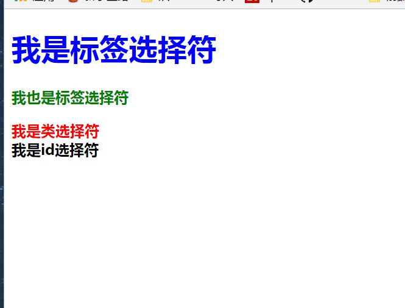
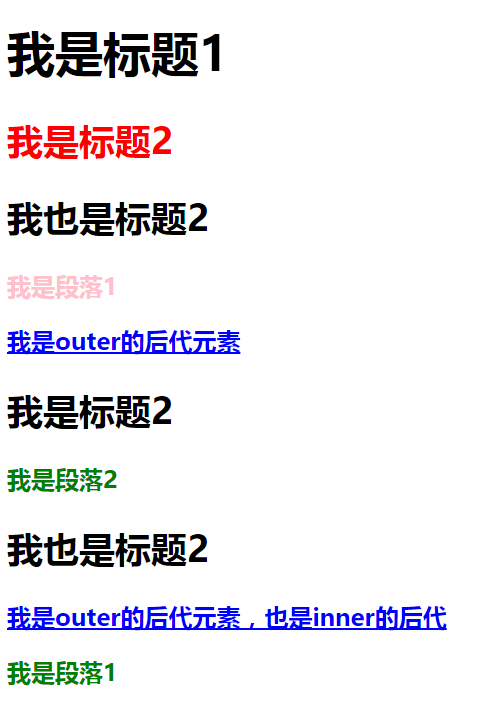
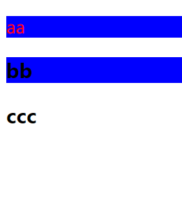

### Selector学习

> 书写规则


selector：选择符，选择了一个或多个需要添加样式的元素（图中 选择则的是  p 元素。

declaration：声明一个单独的规则，指定了要添加样式的属性

Property： 属性名，具体的属性决定元素的样式规则

property value： 在属性名的邮编，冒号的后面，中间最好有空格（便阅读），属性值确定决定属性的值


#### 问题1 id与class选择器的区别

答：html中不能刚出现相同id的元素，而class的类名是可以重复使用的。id选择器具有唯一性，此外ID选择器用于JS选择元素使用，只能获取一个元素


#### 常见选择器
> 分类

* 基本选择符

|选择器|定义|
|:---:|:---:|
|*|通用元素选择器，匹配页面任何元素（这也就决定了我们很少使用）|
|#id|id选择器，匹配特定的id元素|
|.class|类选择器，匹配特定的id的元素|
|element|标签选择器|

> 示例

html结构
```
        <h1>我是标签选择符</h1>
        <p>我也是标签选择符</p>
        <div class="header">
        我是类选择符
        </div>
        <div id="footer">
            我是id选择符
        </div>

```

样式

```
        * {
            font-weight: 700;
        }
        h1 {
            color: blue;
        }
        p {
            color: green;
        }
        .header {
            color: red;
        }
        #footer {
            color: black;
        }

```

结果




* 组合选择器

    A E分别代表一种选择器
    
|选择器| 选择的元素|
|---|---|
|A E|后代选择器，用分隔符分割，匹配A元素所有的后代元素E|
|A,E|多元素选择器，用，分割，同时选择A或E元素|
|A > E|子元素选择器，用>分割，匹配A元素的所有直接子元素E|
|A + E|直接相邻选择器，用+分隔，匹配A元素之后相邻的同级元素E|
|A~E|普通相邻选择器，匹配A元素之后的同级元素E
|

html结构

```
        <div class="outer">
            <h1>我是标题1</h1>
            <h2>我是标题2</h2>
            <h2>我也是标题2</h2>
            <p>我是段落1</p>
        
            <a href="#">我是outer的后代元素</a>
            <div class="inner">
                <h2>我是标题2</h2>
                <p>我是段落2</p>
                <h2>我也是标题2</h2>
                <a href="#">我是outer的后代元素，也是inner的后代</a>
                <p>我是段落1</p>
        
            </div>
        </div>

```

样式

```
        /*多元素选择器 */
        p, a {
            font-weight: 700;
        }

        /* 后代选择器 */
        .outer a {
            color: blue;
        }

        /*子元素选择器*/
        .outer > p {
            color: pink;
        }

        /*直接相邻选择器*/
        h1 + h2 {
            color: red;
        }

        /*普通相邻选择器*/
        h2 ~ p {
            color: green;
        }

```

结果 




* 属性选择器

|选择器	|含义|
|:---|:---|
|E[attr]	|匹配所有具有属性attr的元素，div[id]就能取到所有有id属性的div|
|E[attr = value]	|匹配属性attr值为value的元素，div[id=test],匹配id=test的div|
|E[attr ~= value]	|匹配所有属性attr具有多个空格分隔、其中一个值等于value的元素|
|E[attr ^= value]	|匹配属性attr的值以value开头的元素|
|E[attr $= value]	|匹配属性attr的值以value结尾的元素|
|E[attr *= value]	|匹配属性attr的值包含value的元素|

* 伪类选择器

|选择器	|含义|
|:---|:---|
|E:first-child	|匹配作为长子（第一个子女）的元素E|
|E:link|匹配所有未被点击的链接|
|E:visited	|匹配所有已被点击的链接|
|E:active	|匹配鼠标已经其上按下、还没有释放的E元素|
|E:hover	|匹配鼠标悬停其上的E元素|
|E:focus	|匹配获得当前焦点的E元素|
|E:lang(c)	|匹配lang属性等于c的E元素|
|E:enabled	|匹配表单中可用的元素|
|E:disabled	|匹配表单中禁用的元素|
|E:checked	|匹配表单中被选中的radio或checkbox元素|
|E::selection|	匹配用户当前选中的元素|

>  更多请参考  [MDN](https://developer.mozilla.org/zh-CN/docs/Web/CSS/Reference#%E9%80%89%E6%8B%A9%E5%99%A8)

* 伪元素选择器

|选择器	|含义|
|:---|:---|
|E::first-line	|匹配E元素内容的第一行|
|E::first-letter	|匹配E元素内容的第一个字母|
|E::before	|在E元素之前插入生成的内容|
|E::after	|在E元素之后插入生成的内容|


#### 优先级计算

> 如果多条规则作用于同一个元素上，且定义相同属性的不同值，需要确定那个属性值

规则如下（从高到底排列）

1.在属性后面使用!important会覆盖页面内任何位置定义的元素样式

2. 作为style属性写在元素标签上的内联样式

3. id选择器

4. 类选择器

5. 伪类选择器

6.属性选择器

7. 标签选择器

8. 通配符选择器

9.浏览器自定义


> 复杂场景下的计算规格

两种情况

1. 如果选择器选中了元素，则计算css选择器权重值

规则如下  

* 有一个行内样式 获得一个 a 
* 有一个ID选择器  获得一个 b
* 每有类，属性，伪类选择器 获得一个 c
* 每有标签选择器，伪元素，获得一个 d

举例 

```
*             {}  /* a=0 b=0 c=0 d=0 -> 0,0,0,0 */
p             {}  /* a=0 b=0 c=0 d=1 -> 0,0,0,1 */
a:hover       {}  /* a=0 b=0 c=0 d=2 -> 0,0,0,2 */
ul li         {}  /* a=0 b=0 c=0 d=2 -> 0,0,0,2 */
ul ol+li      {}  /* a=0 b=0 c=0 d=3 -> 0,0,0,3 */
h1+input[type=hidden]{}  /* a=0 b=0 c=1 d=2 -> 0,0,1,2 */
ul ol li.active   {}  /* a=0 b=0 c=1 d=3 -> 0,0,1,3 */
#ct .box p        {}  /* a=0 b=1 c=1 d=1 -> 0,1,1,1 */
div#header:after  {}  /* a=0 b=1 c=0 d=2 -> 0,1,0,2 */
style=""          /* a=1 b=0 c=0 d=0 -> 1,0,0,0 */
```

进行比较时，先比较a的值，谁的值大采用用谁的规则，相同则再比较b的值，同样谁的值大采用谁的规则，一直比到d的值

2. 如果没有直接选中元素，则采用就近原则

```
            结构
            <div id="box">
                <p id="para" class="spec">
                    <span>没有选中</span>
                </p>
            </div>
            样式
            div p {
                color: red;
            }
            #box {
                color:blue;
            }

```

结果文字颜色为红色


#### a:link, a:hover, a:active, a:visited 的顺序是怎样的？ 为什么？

答：顺序是 la:link,a:visited a:hover, a:active

* 鼠标经过的未访问的链接同时拥有a:linka:hover两种属性，后面的属性会覆盖前面的属性定义
* 鼠标经过的已访问的链接同时拥有a:visited、a:hover两种属性，后面的属性会附在前面的属性的定义


#### 下列选择器分别是什么意思

```
        #header{    /* 选择id为header的元素 */
        }
        .header{      /* 选择class类名为header的元素 */
        }
        .header .logo{      /* 选择类名为header元素下 类名为logo的元素 */
        }
        .header.mobile{     /* 选择class类名为header且同时具有类名.mobile的元素*/
        }
        .header p, .header h3{     /* 选择.header元素下所有p元素或者.header 元素下 所有h3元素*/
        }
        #header .nav>li{       /* 选择id名为header下 类名为nav下子代li元素 */
        }
        #header a:hover{    /* 选择id名为header下 标签为a且鼠标正悬停元素， */
        }
        #header .logo~p{  /* 选择id名为header下  和.logo元素同级的p元素*/
        }
        #header input[type="text"]{  /* 选择id名为header下  type属性为text的 input元素*/

```

#### 所熟知的伪类选择器
|||
|---|---|
|E:first-child	|匹配作为长子（第一个子女）的元素E|
|E:link|匹配所有未被点击的链接|
|E:visited	|匹配所有已被点击的链接|
|E:active	|匹配鼠标已经其上按下、还没有释放的E元素|
|E:hover	|匹配鼠标悬停其上的E元素|
|E:last-child|匹配作为老儿子（女儿）（最后一个子女）的元素E|


#### div:first-child和div:first-of-type的作用和区别

div:first-child  匹配的是某父元素的第一个子元素，可以是结构上的第一个子元素，简单来说，匹配div上级元素下的第一子元素是不是div，如果是则匹配成功，否则不能匹配到

div:first-of-type 匹配的是某父元素下相同子类型子元素中的第一个 ，这个选择器的意思是：匹配同级div元素中的第一个div


#### 解释下列代码现象

```

        <style>
        .item1:first-child{
          color: red;
        }
        .item1:first-of-type{
          background: blue;
        }
        </style>
         <div class="ct">
           <p class="item1">aa</p>
           <h3 class="item1">bb</h3>
           <h3 class="item1">ccc</h3>
         </div>
```

结果




解释

.item1:first-child 匹配到了p元素，
 .item1:first-of-type 匹配到了 p 元素和 第一个h3元素；